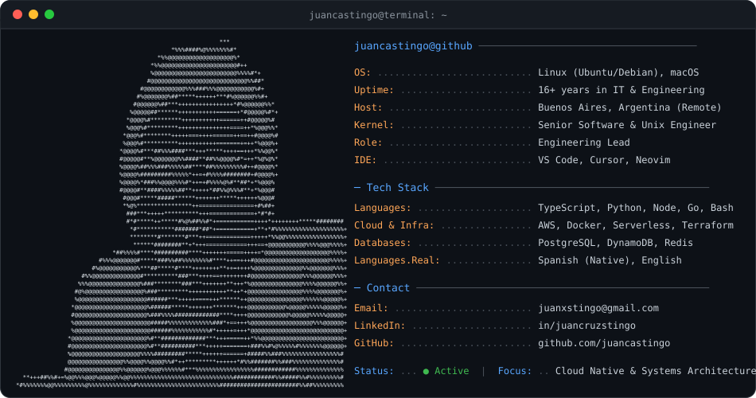

<div align="center">
  <picture>
    <source media="(prefers-color-scheme: dark)" srcset="dark_mode.svg">
    <source media="(prefers-color-scheme: light)" srcset="light_mode.svg">
    
  </picture>
</div>

<br/>

<p align="center">
  <a href="mailto:juanxstingo@gmail.com">
    
  </a>
  <a href="https://github.com/juancastingo">
    
  </a>
  <a href="https://linkedin.com/in/juancruzstingo">
    
  </a>
</p>

---

### 🛠️ Core Tech & Arsenal

```text
  Cloud & Infra  ❯  AWS (Solutions Architect) · Docker · Serverless · Unix/Linux
  Languages      ❯  TypeScript · Python · JavaScript · Go · Bash · SQL
  Backend & Data ❯  Node.js · Express · Flask · PostgreSQL · DynamoDB · Redis
```

---

<p align="center">
  <sub>⚡ Fastfetch & Neofetch Unix Terminal Aesthetic · Auto Dark & Light Mode</sub>
</p>
